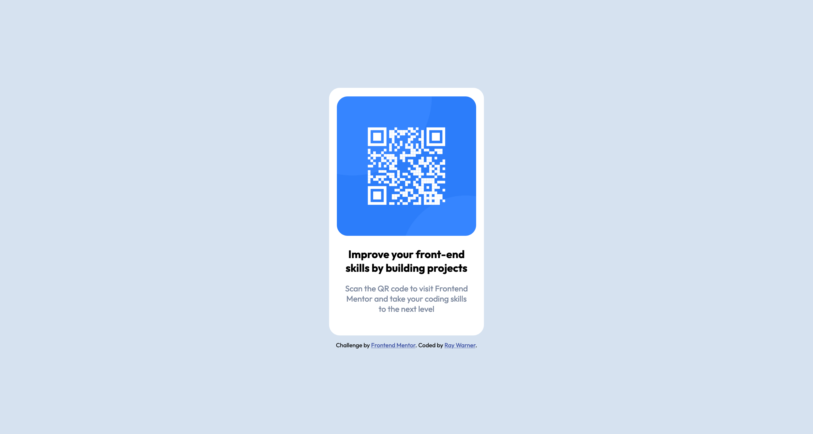

# Frontend Mentor - QR code component solution

This is a solution to the [QR code component challenge on Frontend Mentor](https://www.frontendmentor.io/challenges/qr-code-component-iux_sIO_H). Frontend Mentor challenges help you improve your coding skills by building realistic projects. 

## Table of contents

- [Overview](#overview)
  - [Screenshot](#screenshot)
  - [Links](#links)
- [My process](#my-process)
  - [Built with](#built-with)
  - [What I learned](#what-i-learned)
  - [Continued development](#continued-development)
- [Author](#author)

## Overview

### Screenshot

### Links

- Solution URL: [Add solution URL here](https://your-solution-url.com)
- Live Site URL: [Add live site URL here](https://your-live-site-url.com)

## My Process

After writing the markup, this was mostly just using my eyes to approximate the dimensions, paddings, margins, etc. and then using the provided parameters and specified colors & fonts to finish out the styling. Flexbox was used to simplify the positioning and then other tweaks were made to get the final look.

### Built with

- Semantic HTML5 markup
- CSS custom properties
- Flexbox
- VS Code

### What I learned

I feel I got more practice with Flexbox as well as using custom fonts, which I hadn't really been using in my previous learning projects and bootcamps, primarily because they relied a lot on frameworks like Bootstrap.

### Continued development

I'm looking to continue getting more practice with CSS and Flexbox as I feel other self-started projects I'm working on for my portfolio could use better layout and responsiveness.

## Author

- Website - [Add your name here](https://www.your-site.com)
- Frontend Mentor - [@yourusername](https://www.frontendmentor.io/profile/yourusername)
